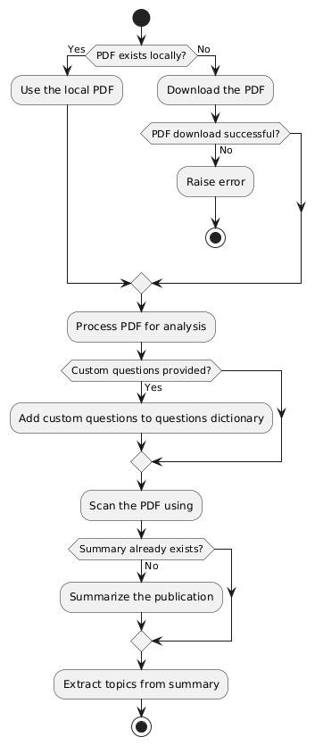
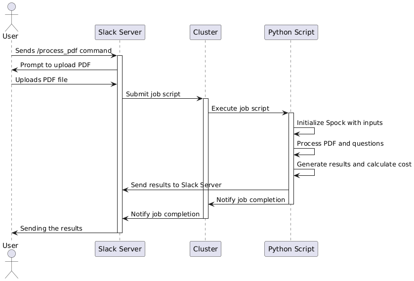

# spock

[](https://pypi.python.org/pypi/spock)

**LLM Literature**

-   Free software: MIT License
-   Documentation: [Spock Documentation](https://youssefbriki1.github.io/spock)
    
# Spock Literature

**Spock Literature** is a Python project that streamlines downloading, analyzing, and summarizing scientific publications using language models. It provides a convenient interface for:

- Downloading PDFs from DOIs, titles, or direct links.  
- Extracting, splitting, and indexing the text from PDF or HTML documents.  
- Querying documents using a Retrieval-Augmented Generation workflow.  
- Summarizing publications and extracting scientific topics and insights.  
- Generating questions and collecting answers directly from the paper.  
- Optionally producing an audio “podcast” version of a publication.

---
## Quick demo:
<video width="640" height="360" controls>
  <source src="images/spock.mp4" type="video/mp4">
</video>

## Table of Contents

- [spock](#spock)
- [Spock Literature](#spock-literature)
  - [Quick demo:](#quick-demo)
  - [Table of Contents](#table-of-contents)
  - [Features](#features)
    - [Key Components](#key-components)
  - [Requirements and Installation](#requirements-and-installation)
  - [Usage Examples](#usage-examples)
  - [Workflow](#workflow)
    - [Spock workflow](#spock-workflow)
    - [Slack workflow](#slack-workflow)

---

## Features

1. **PDF Downloading**  
   - Automatically download papers using:
     - **DOIs** 
     - **Article titles** 
     - **URL links** 

2. **Document Splitting & Indexing**  
   - Uses **LangChain**’s `PyPDFLoader` and `RecursiveCharacterTextSplitter` to chunk long PDFs.  
   - Builds a **FAISS** vector store for advanced retrieval.

3. **LLM Integration**  
   - Supports multiple models:
     - **OpenAI GPT-4** (`gpt-4o` via ChatOpenAI).
     - **LLama** variants (`llama3.3` via OllamaLLM).
   - Summarizes documents, answers questions with context, and extracts relevant scientific topics.

4. **Flexible Q&A**  
   - You can provide your own custom questions, or use the default set in `QUESTIONS`.  
   - Returns both an answer and a supporting sentence from the document.


### Key Components

- **`Helper_LLM`**  
  Manages LLM setup, embedding creation, and chunk indexing logic.
  
- **`Spock`**  
  Extends `Helper_LLM` to add publication-specific workflows (downloading, summarizing, Q&A, etc.).

- **`URLDownloader`**  
  Custom module for handling direct URL-based PDF downloads.


---

## Requirements and Installation

1. **Python 3.9+**  
   This project has been tested on Python 3.9.

2. **Environment Setup**  
   - Clone the repository:  
     ```bash
     git clone git@github.com:AccelerationConsortium/spock.git
     cd spock_literature
     ```
   - Create and activate a virtual environment (recommended):  
     ```bash
     python3 -m venv venv
     source venv/bin/activate
     ```
   - Install dependencies:  
     ```bash
     pip install -r requirements.txt
     ```
   - Ensure you have an **OpenAI** API key if you intend to use those models.  
     Set `OPENAI_API_KEY` in your environment or a `.env` file:
     ```bash
     export OPENAI_API_KEY="sk-..."
     ```

---

## Usage Examples

Below are a few common tasks using the `Spock` class.


Insert video here


## Workflow

### Spock workflow
When calling the a Spock instance, the following steps are executed:



### Slack workflow

When calling the a Spock instance from Slack, the following steps are executed:

We are using the `process_pdf` command as an example.



